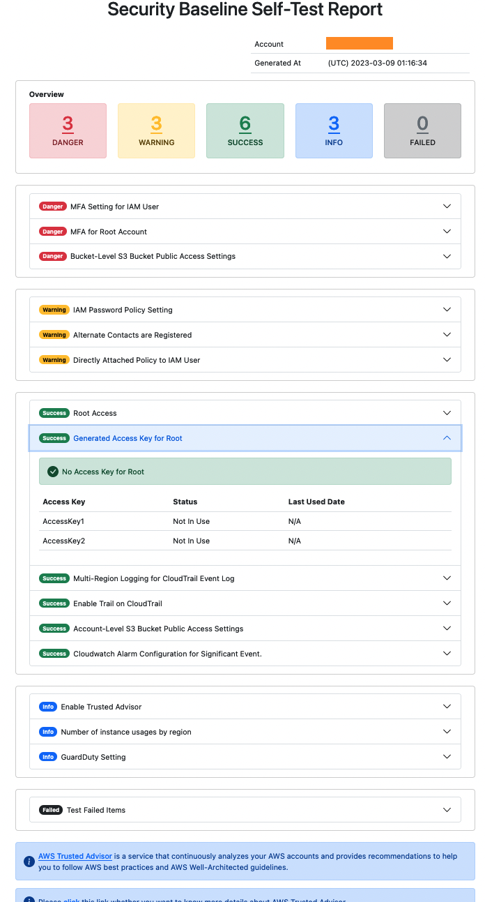

# What is a Security Baseline Self-Test Script?
> According to the [Shared Responsibility Model](https://aws.amazon.com/compliance/shared-responsibility-model/?nc1=h_ls), AWS and customers share the responsibility on security. AWS is responsible for protecting the infrastructure, such as software and hardware that executes all services offered on the cloud. On the other hand, customers have the responsibility to configure and manage the security upon using the AWS cloud services.<br><br>
> Security Baseline Self-Test Application is the `AWS sample application that carries out an examination of the account set-up based on basic security advisories and provide a report as a result.`
<br><br>
Users can simply run Script to perform a security check on AWS accounts and check the results of 15 items, including AWS account security and workload security.

<br>

# Who needs this Script?
> Any AWS customers who would like to get their accounts examined to see if they are observing the basic security advisories will benefit from using this application. We would like to recommend this application especially to first-time AWS users or others who would like to implement their workloads on AWS.   
<br>
On the test report, we are providing multiple ways to effectively respond to security threats on AWS with minimal resources. This makes even early-stage startups who cannot invest much resource on their security suitable for using this application. 

<br>

# How can I start this script?

### [PreRequirement]

<br>

> - install python3
> - install git
> - install [AWS CLI](https://docs.aws.amazon.com/cli/latest/userguide/getting-started-install.html)

### [Create an IAM account with permissions]
<br>

> First, [create an IAM user](https://docs.aws.amazon.com/IAM/latest/UserGuide/id_users_create.html#id_users_create_console) from the account you want to check.
>
> Please refer to the [permission.json](./permission.json) file for IAM user permissions.
>
> Once an IAM user is created, select the Security credentials tab on the IAM user details page and press "Create access key" to create an Access key. <br>[[Create IAM User Access Key](https://docs.aws.amazon.com/IAM/latest/UserGuide/id_credentials_access-keys.html#Using_CreateAccessKey)]
>
> [Set up the credentials file for the AWS CLI](https://docs.aws.amazon.com/cli/latest/userguide/cli-configure-files.html) in an environment where AWS CLI is installed.

<br>

### [Configuring the Python Environment]
> First, download the script using the git clone command.
```bash
git clone https://github.com/aws-samples/security-baseline-self-test.git
```

> Run the command below to create a virtual environment to run the script.<br>
```bash
python3 -m venv ssb-env
```
> Once the virtual environment is created, run the command below to activate it.<br>
> 
> [windows]
```bash
ssb-env\Scripts\activate.bat
```
> [Unix or MacOS]
```bash
source ssb-env/bin/activate
```
> Once the virtual environment is activated, run the command below to install the package needed to run the script.<br>
```bash
python -m pip install -r requirements.txt
```

### [Run Script]
> Run main.py in the [sst](./sst) directory of the downloaded script.
```bash
cd sst
python3 main.py
```
> If you specified the profile name when setting up the credential file in the AWS CLI, you can also run the script by putting the profile name as an executor as shown below.
```bash
python3 main.py security-test
```
> When you run the script, select the language first.<br>
> Currently, English and Korean are supported.<br>
> After the check, view the results report in html format generated within the sst directory.

### [ Report Sample ]

> <br><br>

# FAQ
> *- What can be done to test more items in order to further improve the security? *<br>
> If you want to test the security of more AWS accounts, using the [AWS Trusted Advisor](https://aws.amazon.com/blogs/aws/aws-trusted-advisor-new-priority-capability/) would be a good choice. The AWS Trusted Advisor is a service that analyzes your AWS accounts regularly, and help you follow the AWS security best practices and Well-Architected guidelines. If you manage your security items through AWS Trusted Advisor, you can improve the security of your AWS accounts. 
>
> <br>
>
> *- Where can I find additional information or guidelines on how to improve the AWS security level?*<br>
> AWS is providing the [AWS Well-Architected Tool](https://docs.aws.amazon.com/wellarchitected/latest/userguide/intro.html), a service in the cloud that provides a consistent process for measuring customers’ architectures using AWS best practices. If you need additional information or guidelines to improve your security, you can refer to security best practices on AWS Well Architected Tool’s Security pillar to design and diagnose your architecture. 